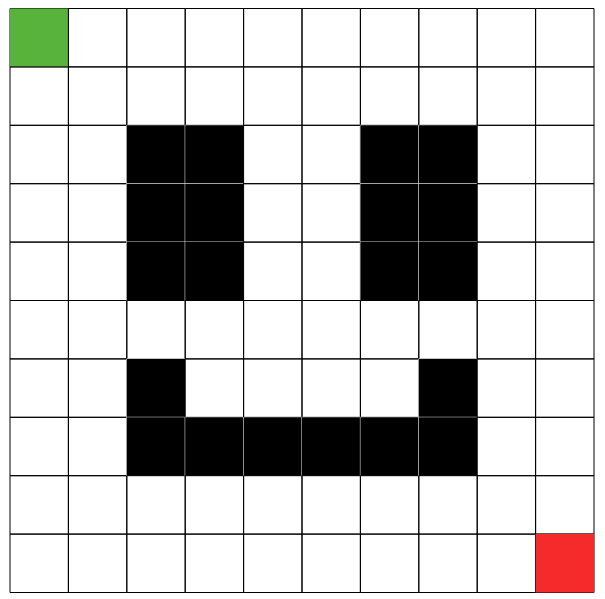
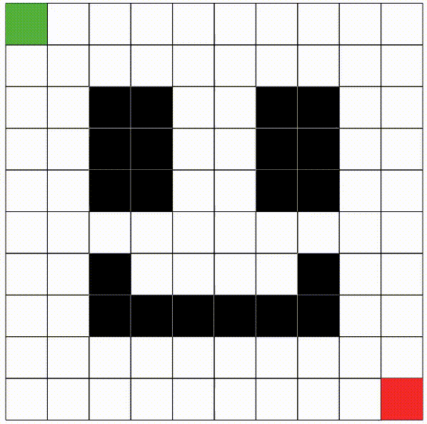

# Pathfinding Algorithms Animator
This project aims to create an animator that shows the behaviour of many pathfinding algorithms.

The project is written with HTML, CSS, JavaScript and Golang.

    &nbsp;&nbsp;&nbsp;&nbsp;
    
    &nbsp;&nbsp;&nbsp;&nbsp;
    
    &nbsp;&nbsp;&nbsp;&nbsp;
    

 
Golang is being used to execute the algorithms in the server side, so javascript will not be responsible for the expensive work. This is important because, not only golang performance is several times better than javascript, but also it's not good to rely on client's machine to execute algorithms

## The Grid
The grid you see in the software is a visual representation of a graph, where every square is a vertex. The vertices are connected with their adjacent vertices, including the diagonals if "Diagonals" switch is on.

The edge weight is, by default, set to 1, but diagonals will get the euclidian distance as the weight, therefore:
$ w=\sqrt{1^2+1^2}=\sqrt{2}\approx1.41 $

### Grid colors
 Green: Start point 
 Red: Finish point 
 Black: Obstacle 

 Purple: Current vertex being visited 
 Light Purple: Already visited vertices 
 Orange: The path 

 Dijkstra pathfinding algorithm demo

