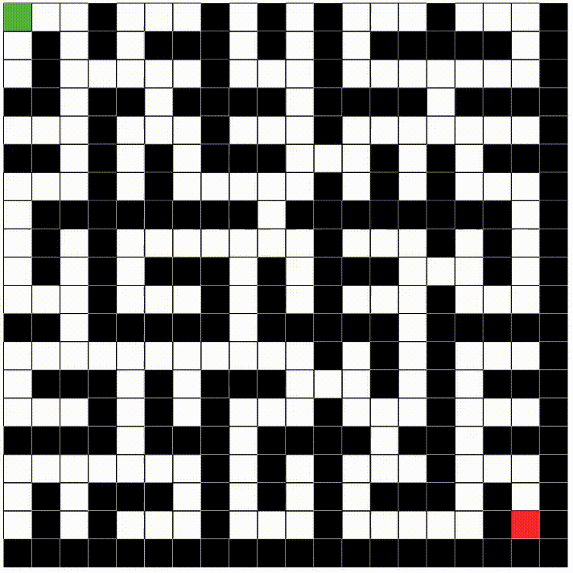
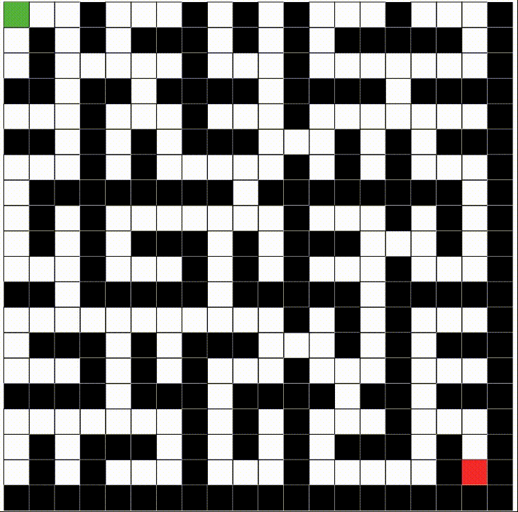

# Pathfinding Algorithms Animator
The aim of this project is to create an animator that demonstrates the behavior of various pathfinding algorithms.

The project is developed using HTML, CSS, JavaScript, and Golang.

    &nbsp;&nbsp;&nbsp;&nbsp;
    
    &nbsp;&nbsp;&nbsp;&nbsp;
    
    &nbsp;&nbsp;&nbsp;&nbsp;
    

 
Golang is used to execute the algorithms on the server side, so JavaScript is not responsible for the expensive work. This is crucial because Golang's performance is several times better than JavaScript, and relying on the client's machine to execute algorithms can lead to severe performance issues.

## The Grid
The grid shown in the software is a visual representation of a graph, where each square is a vertex. The vertices are connected with their adjacent vertices, including the diagonals if the "Diagonals" switch is on.

By default, the edge weight is set to 1, but diagonals will get the Euclidean distance as their weight, which is approximately 1.41

$w=\sqrt{{1^2}+{1^2}}=\sqrt{2}\approx1.41$

Note: Obstacles do not create any edges to other vertices.

### Grid colors
 Green: Start point 
 Red: Finish point 
 Black: Obstacle 

 Purple: Current vertex being visited 
 Light Purple: Already visited vertices 
 Orange: The path 

## Demos
Dijkstra:

 
 
A*:

